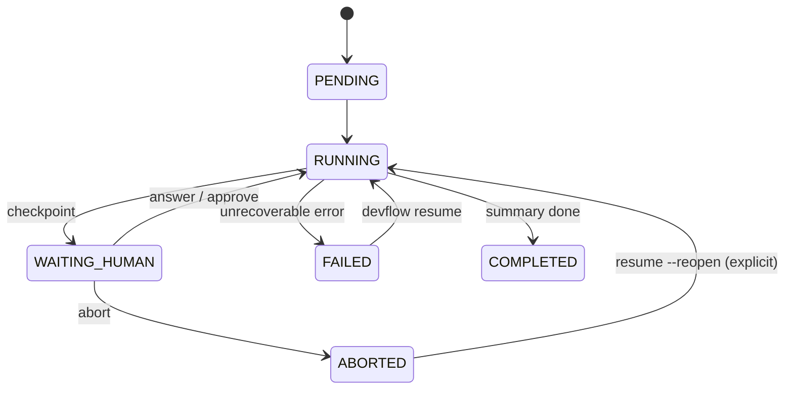
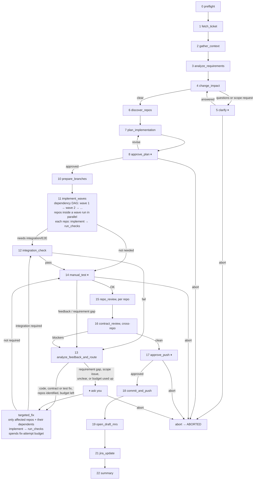
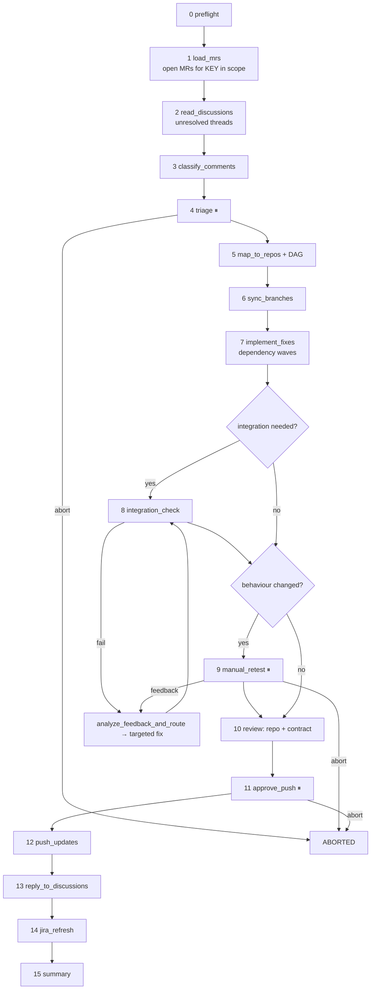

# Workflow design: Jira ticket implement (v2)

Status: **built** (`src/dev_workflows/jira_implement/`; approved design, kept as the reference). Takes one Jira key (e.g. `AQS-5512`) from requirements to draft GitLab MRs across the affected repos, updating Jira along the way. Confluence is only read. Review feedback on those MRs is handled by a separate workflow, [`address-review`](#companion-workflow-address-review).

**Inputs:** `devflow implement AQS-5512 [--repos api-service,web-portal]`. The Jira key is required. `--repos` is a **hard allow-list**: repo names from `workspace.yaml` or local paths. Without it, the allow-list is every repo in `workspace.yaml`.

Other commands: `devflow resume <run_id>`, `devflow status <run_id>`, `devflow abort <run_id>`, `devflow show <run_id>` (audit log).

---

## 1. Guardrails (hold for every node)

| Guardrail | How it is enforced |
|---|---|
| **rtk on every git/glab call** | One `run_vcs(repo, args)` helper builds `rtk git ...` / `rtk glab ...`. No node runs a subprocess for git or glab any other way, and a test scans the code for violations. `run_vcs` also refuses `push --force`, `mr merge`, `mr approve` and branch deletion. |
| **Repo scope is a hard allow-list** | `ScopeGuard` is built once in preflight and frozen in state. Every `run_vcs` call, every Claude Code launch and every file path is checked against it. An LLM output naming a repo outside the list is never acted on: it becomes a **scope request**, which pauses for you (see §6). |
| **Confluence strictly read-only** | `ConfluenceReader` exposes only read tools from the Confluence MCP (get page, get children, search, get attachments). Write tools are removed before any node or the coding agent sees them, Claude Code is launched with Confluence write tools denied, and a test fails if a write tool is reachable. |
| **Claude Code does the coding, LangGraph orchestrates** | Coding nodes start Claude Code headless (Agent SDK) with `cwd` set to the repo and only that repo's directory allowed, so it uses your coding skills, MCPs and the repo's `CLAUDE.md`. LangGraph owns the flow, the state and every side effect. |
| **Mandatory human checkpoints** | `clarify` (when there are questions), `approve_plan`, `manual_test` and `approve_push` cannot be skipped by any flag or by the LLM. Each one offers **Abort**. |
| **Draft MRs, no auto-merge** | MRs are created with `--draft`. No node can merge, approve or un-draft an MR. |
| **No CI/CD** | The workflow works only on your local clones. It never reads, watches, triggers or fixes pipelines, and `run_vcs` refuses `glab ci` / `glab pipeline` commands. |
| **Resumable** | The LangGraph SQLite checkpointer saves state after every node. Side effects use write-ahead intents (see §5), so a crash between a side effect and its checkpoint is detected on resume. |

`workspace.yaml` lists the repos: name, local path, GitLab project, base branch (`develop`), the lint, typecheck, test, build and run commands, and whether the repo has a UI.

---

## 2. Run lifecycle

| State | Meaning | Entered when |
|---|---|---|
| `PENDING` | Run created and inputs saved, but no node has started. | `devflow implement` writes the run record. |
| `RUNNING` | A node is executing. | Any node starts, or a run resumes. |
| `WAITING_HUMAN` | Paused at a checkpoint and waiting for your answer. `pending_checkpoint` says which one and what it needs. | Any ⏸ node, a scope request, a branch-ownership question, a used-up fix-attempt budget, or an unclear case from `analyze_feedback_and_route`. |
| `FAILED` | Stopped on an error the workflow cannot fix itself (preflight gaps, tool outage after retries, an unrecoverable error). It is **resumable** once the cause is fixed. | An unrecoverable node error. |
| `ABORTED` | You chose Abort. **Terminal**: no later node runs, so there are no further side effects. The checkpoint and audit log are kept, and `devflow resume --reopen <run_id>` can continue it only with your explicit confirmation. | Abort at any checkpoint, or `devflow abort`. |
| `COMPLETED` | The summary is written. Draft MRs are open and Jira is updated. | `summary` finishes. |



A process killed mid-node leaves the run as `RUNNING` with a stale heartbeat. The next `devflow resume` (or `status`) detects it, reconciles any open intents (§5) and continues from the last checkpoint.

---

## 3. Main flow



After `targeted_fix`, a run always goes back through `integration_check` (when it is required) and **`manual_test`** before it can reach `approve_push`. You never push code you haven't tested.

---

## 4. Nodes

### Phase 0: Preflight
| # | Node | Does | Writes to state |
|---|---|---|---|
| 0 | `preflight` | Creates the run (`PENDING`) and builds the frozen `ScopeGuard` from `--repos` or `workspace.yaml`. It checks: `rtk`; `rtk git`; `rtk glab auth status`; Jira MCP read **and** write; the ticket's status and assignee (read only: it warns if the ticket is not assigned to you or not *In Progress*, but changes nothing); Confluence MCP **read only**; Playwright MCP; Claude Code and your coding skills; and that each in-scope repo exists, is clean, and can reach `origin`. If anything is missing it stops as `FAILED` with one list of gaps. | `run_id`, `scope`, `env_report` |

### Phase 1: Understand
| # | Node | Does | Writes to state |
|---|---|---|---|
| 1 | `fetch_ticket` | Jira MCP, only what implementation needs: ticket key, title, description and attachments. Files are downloaded, and images go to the model as images. It also collects the ticket's Confluence links. | `ticket` |
| 2 | `gather_context` | Reads, read-only, the Confluence pages linked from the ticket (including child pages and tables). It extracts the **detailed requirement** and the **current related business**, citing the page and section for each point, and flags conflicts with the Jira text. With no linked page, it does a key-term search and marks the results unconfirmed. It also finds existing MRs that mention the key. | `requirement_spec`, `current_business`, `context_docs` |
| 3 | `analyze_requirements` | LLM: summary, type (feature/bug/chore), testable acceptance criteria, and blocking questions. | `analysis` |
| 4 | `change_impact` | LLM plus a light read-only search inside the scope. It decides: **affected layers** (FE/BE/DB); **candidate repos** (only from the scope); **cross-repo contract changes** (API, DTOs, events, shared types); **migration requirements** (schema, data backfill, ordering); a **risk level** (low/medium/high, with reasons); and **testing required**: integration yes/no, E2E yes/no, manual test focus. A repo it believes is needed but is outside the scope becomes a scope request. | `impact` |
| 5 | `clarify` ⏸ | Shown when step 3 or 4 has open questions or scope requests. You answer, approve or deny each scope request, or abort. Answers go back to step 4, so the impact is recomputed with them. | `answers`, `decisions[]` |

### Phase 2: Plan
| # | Node | Does | Writes to state |
|---|---|---|---|
| 6 | `discover_repos` | For each candidate repo (in scope only): `rtk git fetch origin`, then a read-only search for the touched modules, routes, components and tables. It confirms or drops each candidate. | `repo_findings` |
| 7 | `plan_implementation` | LLM: per-repo tasks, plus an explicit **dependency DAG** between repos, for example `shared-lib → api-service → web-portal`, with `batch-jobs` independent. Each edge names what flows along it: a contract, a type package or a migration. It also produces the contracts to fix up front, migration steps, a test plan mapped to the acceptance criteria, and the merge order derived from the DAG. The DAG is validated: acyclic, every node in scope, every contract change from step 4 covered. | `plan`, `dag` |
| 8 | `approve_plan` ⏸ | Shows the plan, the DAG and the waves it produces. You **approve**, **revise** with notes (back to 7) or **abort**. | `decisions[]` |
| ~~9~~ | ~~`jira_start`~~ | **Removed.** You assign the ticket and move it to *In Progress* yourself before starting, so the workflow writes nothing to Jira here. Numbers are kept so earlier comments still match. | — |

### Phase 3: Implement and verify
| # | Node | Does | Writes to state |
|---|---|---|---|
| 10 | `prepare_branches` | Idempotent, per repo: `rtk git fetch origin`, `rtk git checkout develop`, `rtk git pull origin develop`, then `rtk git checkout -b <KEY>`, and records ownership: the run id in local git config (`rtk git config branch.<KEY>.devflow-run <run_id>`) and the base sha in state. An existing `<KEY>` branch is handled by the **branch reuse rule** in §5. | `repos[r].branch`, `base_sha`, `branch_owner` |
| 11 | `implement_waves` | Topologically sorts the DAG into **waves**. The repos in one wave run in parallel (`Send`), and each wave starts only after every repo in the previous wave has passed its checks. Per repo, Claude Code implements that repo's tasks, getting the frozen contracts plus the actual diffs of its upstream repos, then `run_checks` runs the lint, typecheck, unit tests and build. A failure re-runs that repo only, spending its run-wide fix-attempt budget (see the cap below); once the budget is used up, it pauses ⏸. If Claude Code reports that it needs an out-of-scope repo, the run pauses with a scope request. | `repos[r].status`, `fix_attempts_used`, `checks`, `diff_stat` |
| 12 | `integration_check` | Runs only when `impact` requires it. It checks the contracts against the code in every repo, starts the services, and Playwright MCP walks each UI acceptance criterion, saving screenshots. **It never routes back to implementation directly.** A failure goes to step 13. | `integration_report`, `e2e_evidence` |
| 13 | `analyze_feedback_and_route` | Takes any input that may need a change, not only failures: **integration/E2E failures**, **manual-test feedback**, **review blockers**, **requirement gaps**, **contract issues**, **test issues** (the test is wrong vs the code is wrong) and **scope issues**. Using local evidence only (never CI), it classifies each item and decides the **affected repo or repos**, the cause and a confidence level, then routes it: a code, contract or test fix in in-scope repos with high confidence goes to `targeted_fix`; a requirement gap goes back to you as a question; a scope issue becomes a scope request ⏸; an **unclear case** (low confidence, conflicting evidence, or a repo with no fix attempts left) pauses ⏸ and asks you. | `feedback_items[]` |
| — | `targeted_fix` | Re-runs implement and checks **only** for the routed repos. Their downstream dependents in the DAG are re-run too, but only when a contract they consume changed. Every re-run spends the repo's **fix-attempt budget** (see the cap below). It cannot add attempts: a repo with no budget left is never re-run automatically. | `repos[r]` |
| 14 | `manual_test` ⏸ | **Mandatory.** All in-scope repos are on `<KEY>` with every edit applied and nothing committed yet. It shows the changed files, how to run each repo, and a checklist built from the acceptance criteria and the manual test focus from step 4. You answer **OK**, **feedback** (goes to 13) or **abort**. Any code change after this point means testing again here. | `manual_test_result`, `decisions[]` |
| 15 | `repo_review` | Per repo, in parallel: the `pr_review` graph reviews that repo's diff against its own tasks. | `reviews[r]` |
| 16 | `contract_review` | Cross-repo: the producer and consumer of each contract agree; migrations match the code that uses them; the merge order is safe (for example the backend can deploy before the frontend); and every acceptance criterion is covered somewhere. Blockers go to 13. | `contract_review` |

**Fix-attempt cap.** Each repo has a **total budget of 3 automated fix attempts for the whole run**:
- One attempt is one automated Claude Code edit pass on that repo after its first implementation. That covers a retry after failed checks, and a `targeted_fix` coming from integration, manual test, review or any other feedback.
- The counter (`fix_attempts_used`) is stored in state and **never reset**, whether the run moves through integration, manual test, review or more fix loops, or is resumed after a crash.
- When a repo reaches 3, nothing can start another automated attempt for it, `targeted_fix` included. The run pauses ⏸ for you: fix it by hand and continue (checks and the following gates re-run with no automated edit), or abort.

### Phase 4: Deliver
| # | Node | Does | Writes to state |
|---|---|---|---|
| 17 | `approve_push` ⏸ | **Mandatory.** Shows every repo's diff, the checks, the integration and E2E evidence, your manual-test result, both reviews, and the merge order. You **approve** or **abort**. | `decisions[]` |
| 18 | `commit_and_push` | Idempotent, per repo: commits `<KEY>: <summary>` with a `Devflow-Run: <run_id>` trailer, then `rtk git push -u origin <KEY>`. It never force-pushes. | `repos[r].head_sha`, `pushed_sha` |
| 19 | `open_draft_mrs` | Idempotent, per repo: finds an existing MR for `<KEY>` or creates one with `rtk glab mr create --draft --target-branch develop`. The description links the Jira ticket, the sibling MRs and the merge order. It never merges. | `repos[r].mr_iid`, `mr_url` |
| ~~20~~ | ~~`watch_pipelines`~~ | **Removed.** The workflow does not touch CI/CD in any way: no pipeline status, no CI logs, no CI fixes. All verification happens on your local clones (checks, integration/E2E, manual test). | — |
| 21 | `jira_update` | Idempotent: moves the ticket to *Code Review* only if it is behind that status, and adds or updates **one** delivery comment with the MR links and local test results. | `side_effects[]` |
| 22 | `summary` | Final report: what changed per repo, branches, MRs and merge order, local check, E2E and manual-test results, decisions taken, and Confluence pages that look out of date (for their owner to update). Sets `COMPLETED`. | `output` |

**Abort** is a node too: it records who aborted, at which checkpoint and why, and sets `ABORTED`. It ends the graph, so no later node runs. Local branches and uncommitted edits are left untouched and listed in the audit log.

---

## 5. Idempotent side effects

Every side effect follows **intent → act → record**:
1. Save an intent `{id, step, repo, action, expected}` to state (a checkpoint).
2. Perform the action.
3. Save the result against the intent (a checkpoint).

On resume, any intent without a result is **reconciled**: the node queries the real world before it acts again.

| Side effect | How existing results are detected |
|---|---|
| Jira status change | Reads the current status first, and transitions only if the ticket is behind the target. |
| Jira comment | Each comment ends with a hidden marker `devflow:<run_id>:<step>`. The node searches for the marker and updates that comment instead of adding a new one. |
| Branch creation | `rtk git rev-parse --verify <KEY>`, `rtk git ls-remote --heads origin <KEY>`, and the ownership marker `branch.<KEY>.devflow-run`. **Branch reuse rule:** the branch is reused automatically only when its owner is **this run** *and* its base sha matches the recorded one *and* it has not diverged from `origin/<KEY>`. If the owner is a previous or different run, or is unknown (no marker, a remote-only branch, or a branch you made by hand), or the base or divergence check fails, the run pauses ⏸ and shows the owner, base sha, commits ahead and behind, and any uncommitted changes. You choose **reuse** (explicit approval, logged; the branch then becomes owned by this run) or **abort**. It never deletes, resets or overwrites a branch. |
| Commit | Skipped when the tree is clean and `HEAD` already carries this run's `Devflow-Run` trailer. |
| Push | Compares local `HEAD` with `origin/<KEY>` and skips if they are equal. If the remote is ahead or has diverged, it pauses ⏸ (it never forces). |
| MR creation | `rtk glab mr list --source-branch <KEY>` first. An existing MR is updated, not duplicated. |
| MR discussion reply (address-review) | Each reply carries the marker `devflow:<run_id>:<discussion_id>`. An existing reply is edited, not posted again. |

---

## 6. Repo scope guard

- `scope` is frozen at preflight. Only an explicit, logged human decision can widen it.
- Every way the workflow could expand scope ends in the same pause, **scope request ⏸**: `change_impact` names a repo, `discover_repos` finds a dependency, Claude Code needs a file in another repo, or `analyze_feedback_and_route` points outside. The pause shows the repo, the reason and the evidence. **Approve** adds it to the scope; that decision is logged, and preflight checks run for the new repo. **Deny** continues without it, recording the gap. **Abort** ends the run.
- `run_vcs`, `ConfluenceReader` and the Claude Code launcher all check `ScopeGuard` and raise an error instead of acting on an out-of-scope path. A test checks every entry point.

---

## 7. State model (persisted in every checkpoint)

```text
RunState
  run_id, ticket_key, status (lifecycle), current_node, heartbeat_at
  pending_checkpoint: {name, payload, options[approve|revise|feedback|abort|...]}
  scope: frozen allow-list            scope_requests[]: {repo, reason, evidence, decision}
  ticket, requirement_spec, current_business, context_docs
  analysis, impact {layers, candidate_repos, contract_changes, migrations, risk, testing_required}
  plan {tasks_by_repo, contracts, migrations, test_plan, merge_order}, dag {nodes, edges, waves}
  repos{name: RepoState}
    RepoState: status(pending|implementing|checks_failed|ready|pushed), branch, base_sha, head_sha, pushed_sha,
               branch_owner, fix_attempts_used (0..3, never reset), checks, diff_stat, review, mr_iid, mr_url
  integration_report, e2e_evidence, manual_test_result, contract_review
  feedback_items[]: {source(integration|e2e|manual_test|review|requirement|contract|test|scope|other), category, repos, cause, confidence, routed_to(targeted_fix|human|scope_request)}
  side_effects[]: {id, step, repo, action, status(intent|done|reconciled), result}
  decisions[]: {checkpoint, choice, note, at}      # audit log
  errors[]: {node, error, at, retryable}
  output
```

---

## 8. Failure and recovery

| Situation | Behaviour |
|---|---|
| Transient tool error (network, MCP timeout, rate limit) | The node retries 3 times with backoff, then sets `FAILED` (resumable). |
| Checks fail in a repo | That repo alone is re-run, spending its fix-attempt budget. Once the budget is used up, it pauses ⏸: you fix it by hand and continue (checks re-run, no automated edit), or abort. |
| Integration/E2E failure, manual-test feedback, review blocker, requirement gap, contract, test or scope issue | Goes to `analyze_feedback_and_route`, then only to the affected repos (`targeted_fix`, within budget), or to you for requirement gaps, scope issues and unclear cases. After any code change it goes through integration (if required) and **manual_test** again. Nothing goes back to all repos. |
| Crash or kill mid-node | Resume from the last checkpoint. Open intents are reconciled before any side effect repeats. |
| Abort at a checkpoint | `ABORTED`, terminal, audit kept, and no further side effects. |
| Preflight gaps | `FAILED` with the full list. Resume after fixing them re-runs preflight. |

---

## Companion workflow: `address-review`

A separate graph, `devflow address-review AQS-5512 [--repos ...]`, run after reviewers comment. It has the same guardrails, lifecycle, checkpointing, idempotency and scope guard. It uses the existing `<KEY>` branches and never creates new ones.



| # | Node | Does |
|---|---|---|
| 1 | `load_mrs` | Finds the draft or open MRs whose source branch is `<KEY>`, in scope only. |
| 2 | `read_discussions` | Reads the unresolved discussion threads with their file and line positions. |
| 3 | `classify_comments` | Puts each thread into one of: must-fix, suggestion, question, out-of-scope, or disagree (with a reason), and links it to its repo and code location. |
| 4 | `triage` ⏸ | You confirm which threads to fix, which to answer only, and which to skip, or abort. |
| 5 | `map_to_repos` | Builds the affected repo set and a small DAG for the fixes (for example, a backend change that the frontend must follow). |
| 6 | `sync_branches` | `rtk git fetch origin`, `rtk git checkout <KEY>`, `rtk git pull origin <KEY>`. It stops if a reviewer pushed changes that conflict. |
| 7 | `implement_fixes` | Claude Code applies the fixes in dependency waves, then checks run. This run has its own fix-attempt budget of 3 per repo, with the same rules. |
| 8 | `integration_check` | Only when a contract or cross-repo behaviour changed. |
| 9 | `manual_retest` ⏸ | Required whenever the fixes change behaviour (not for comment-only or rename-only fixes). |
| 10 | `review` | Repo review plus contract review on the new commits. |
| 11 | `approve_push` ⏸ | Mandatory. |
| 12 | `push_updates` | Idempotent commit and push. It never forces. |
| 13 | `reply_to_discussions` | Idempotent reply on each handled thread, saying what changed and in which commit, or answering the question. It does not resolve threads; the reviewer does. |
| 14 | `jira_refresh` | Updates the single delivery comment on the ticket. It does not change the status. |
| 15 | `summary` | Final report for this round of review fixes. |

Reading threads and replying in them needs GitLab's discussions API, so `run_vcs` allows exactly three `rtk glab api` calls: list an MR's discussions (GET), reply in a thread (POST `.../discussions/<id>/notes` with only a `body`), and edit that reply (PUT `.../notes/<id>` with only a `body`). Every other `glab api` call, including resolving a thread, stays refused. Threads whose last note is already a devflow reply are skipped until the reviewer answers.

---

## Defaults (tell me if any are wrong)
1. A branch named by the ticket key alone (`AQS-5512`), created from the latest `develop`; commits are `AQS-5512: summary`, and MRs target `develop`. *(Set by you.)*
2. You move the ticket to *In Progress* before starting; the workflow only moves it to *Code Review* at step 21. *(Set by you.)*
3. MRs are always draft; the workflow never merges, approves or un-drafts. *(Set by you.)*
4. The only Jira writes are at step 21: the move to *Code Review* and one delivery comment, both idempotent. Confluence is read-only, with no exceptions. *(Set by you.)*
5. Claude Code is the coding engine and LangGraph is the orchestrator. *(Set by you.)*
6. **Fix-attempt budget: 3 per repo for the whole run** (see §4, fix-attempt cap). It is never reset and `targeted_fix` cannot exceed it; at 3 the run pauses for you. *(Set by you.)*
7. Repos run in dependency waves, with parallelism only inside a wave. *(Set by you.)*
8. All repos are edited and you test manually before review, commit and push. Any later code change means testing again. *(Set by you.)*
9. No CI/CD: the workflow never reads, watches or reacts to pipelines. Verification is local only. *(Set by you.)*
10. `analyze_feedback_and_route` asks you, rather than guessing, for anything below "high" confidence and for every requirement gap or scope issue.
11. No mail or Outlook steps. *(Set by you.)*

## What changed from v1
| Your point | Where it is now |
|---|---|
| 1. `change_impact` | New step 4, which feeds `clarify`, `discover_repos`, the plan and the test gates. |
| 2. Dependency-aware implementation | Step 7 produces a validated DAG; step 11 runs it in waves, parallel only within a wave. |
| 3–4. No blind loops back | Integration, manual-test, review, requirement, contract, test and scope feedback all go through `analyze_feedback_and_route`, then only to the affected repos or to you. |
| 5. Lifecycle states | §2, with a `status` field and `pending_checkpoint` in state. |
| 6. Abort | Offered at every ⏸. `ABORTED` is terminal and audited, with no later side effects. |
| 7. Idempotency | §5, using intent → act → record plus a check of the real world on resume. |
| 8. Scope guard | §6, a frozen allow-list with scope requests as the only way to widen it. |
| 9. Split review | Steps 15 (per repo) and 16 (cross-repo contracts). |
| 10. Manual test | Step 14 is mandatory, and is re-required after any later code change. |
| 11. address-review | Now its own workflow, described above. |
| Final refinements | `diagnose_failure` renamed `analyze_feedback_and_route` and covers all feedback kinds; fix-attempt cap is a run-wide budget of 3 per repo that is never reset; branch reuse needs this run's ownership, otherwise you approve it. |
| No CI/CD | Step 20 `watch_pipelines` and the CI failure pause removed; CI is no longer a failure source; `run_vcs` blocks `glab ci`. |
| Your Jira comment | Step 9 `jira_start` removed; preflight only reads the ticket's status and assignee. |
| 12. Consistency | The flow, nodes, state model, failure table and defaults were rewritten together. |
